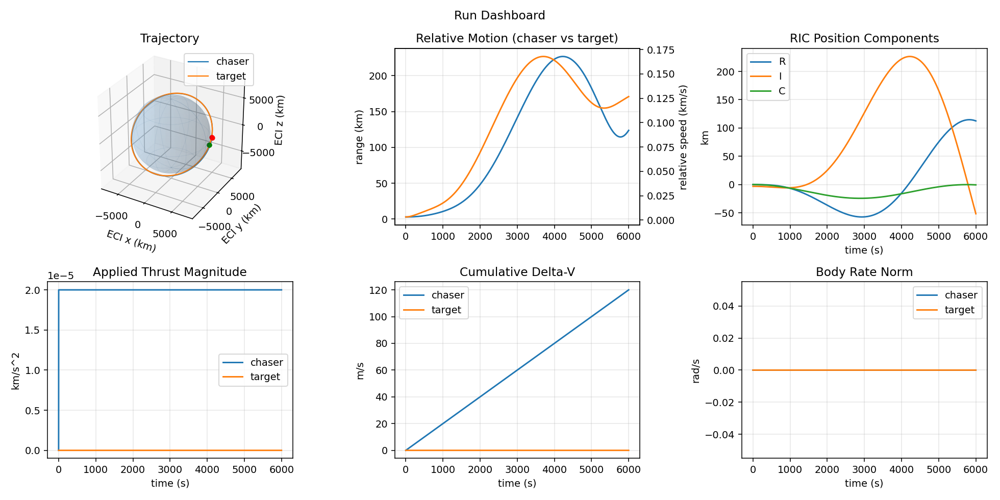

# Orbital Engagement Lab

[](https://github.com/adamcohen8/orbital-engagement-lab/actions/workflows/ci.yml)

Open-core spacecraft simulation platform for closed-loop rendezvous, proximity
operations, attitude control, sensing, estimation, plotting, and mission
prototyping.

Orbital Engagement Lab exists to make it easier to prototype spacecraft behavior
as a full closed loop: orbit dynamics, attitude dynamics, sensors, estimators,
controllers, actuators, mission logic, and outputs all running from the same
scenario definition.



The public repository is the simulation foundation: deterministic single-run
scenarios, public controllers, estimators, object presets, plots, curated
examples, the GUI, and API workflows. Orbital Engagement Pro adds workflow
acceleration around that foundation: controller benchmarking, optimization,
campaign orchestration, sensitivity studies, dashboards, AI-assisted campaign
reports, cost estimation, curated validation scenario packs, and integration
workflows.

## First Run

```bash
git clone https://github.com/adamcohen8/orbital-engagement-lab.git
cd orbital-engagement-lab
python3 -m venv .venv
source .venv/bin/activate
python -m pip install -U pip
python -m pip install ".[dev]"
```

Validate the bundled smoke scenario:

```bash
python run_simulation.py --config configs/automation_smoke.yaml --validate-only
```

Run it:

```bash
python run_simulation.py --config configs/automation_smoke.yaml
```

Expected result: the run completes headlessly and writes summary artifacts under
`outputs/automation_smoke/`.

Generate a public plotting demo:

```bash
python run_simulation.py --config configs/plotting_rendezvous_demo.yaml
```

Expected result: the run writes dashboard, rendezvous, control, estimation, and
sensor-access plots under `outputs/plotting_rendezvous_demo/`.

Use the API:

```python
from sim import SimulationConfig, SimulationSession

cfg = SimulationConfig.from_yaml("configs/automation_smoke.yaml")
session = SimulationSession.from_config(cfg)
result = session.run()

print(result.summary["scenario_name"])
```

Open the GUI:

```bash
python -m pip install ".[gui]"
python run_gui.py
```

The public CLI and GUI are intentionally scoped to deterministic single-run
scenarios. Batch analysis settings are not exposed in public examples, and
configs with enabled Monte Carlo or sensitivity studies are rejected with a clear
Pro-boundary message.

Spherical-harmonic gravity can use inline YAML terms or coefficient files you
provide. HPOP/GGM03 validation data is not bundled in the public core, so
`source: "hpop_ggm03"` scenarios should also set `coeff_path`.

## What This Public Core Includes

- deterministic step-based simulation
- multi-object orbit and attitude dynamics
- two-body, perturbation, atmosphere, SRP, third-body, and spherical harmonics support
- actuator limits, saturation, lag, and mass depletion
- relative sensing and object-knowledge primitives
- orbit and attitude estimators
- orbit and attitude controller interfaces and reference controllers
- YAML-backed scenario configuration with reusable object presets
- Python API, CLI, GUI entrypoints, and curated config examples
- single-run dashboards, trajectory plots, estimation plots, and sensor-access plots
- machine-learning environment helpers
- product maturity roadmap and public/private boundary documentation

## What Orbital Engagement Pro Adds

- controller-benchmark suites and leaderboards
- optimization and gain-tuning workflows
- Monte Carlo and sensitivity campaign orchestration
- campaign dashboards, baselines, and review-ready reports
- AI-assisted report generation with user-supplied LLM API keys
- report cost estimation before hosted LLM calls
- curated validation and mission-assurance scenario packs
- cFS/SIL and program-specific flight-software integration workflows

The public core is intended to be useful on its own. The pro layer is for teams
that need repeatable analysis workflows, tuning loops, campaign management, and
reporting on top of the same simulation foundation. Public examples do not
require hosted AI accounts or API keys.

## Start Here

- [Quickstart](docs/quickstart.md)
- [Scenario YAML](docs/scenario-yaml.md)
- [Plotting](docs/plotting.md)
- [Plot Gallery](docs/plot-gallery.md)
- [Public Core And Pro Boundary](docs/public-vs-pro.md)
- [Engine Contract](docs/contracts/engine-contract.md)
- [Scenario YAML Contract](docs/contracts/scenario-yaml-contract.md)
- [Payload And Artifact Contract](docs/contracts/payload-artifact-contract.md)
- [Product Maturity Roadmap](product_maturity_roadmap.txt)

## Curated Examples

Curated examples are YAML scenario configs under `examples/configs/`:

- `examples/configs/public_rendezvous_closed_loop.yaml` for closed-loop rendezvous, pointing, sensing, estimation, and plots
- `examples/configs/public_orbit_environment_stack.yaml` for deterministic high-fidelity orbit/environment propagation
- `examples/configs/public_manual_engagement.yaml` for manual/game scenario wiring

The public examples are intentionally config-first. Experimental Python demos
and local-artifact-dependent workflows are not part of the supported public
example surface.

## Install Profiles

```bash
python -m pip install .
python -m pip install ".[dev]"
python -m pip install ".[gui]"
python -m pip install ".[ml]"
python -m pip install ".[full]"
```

## Project Layout

- `sim/core/` kernel, models, scheduling
- `sim/config/` config schema, fidelity profiles, plugin validation
- `sim/api.py` public programmatic API
- `sim/dynamics/` orbit and attitude dynamics
- `sim/actuators/` actuator models
- `sim/sensors/` sensor models
- `sim/estimation/` EKF/UKF and joint-state estimation
- `sim/control/` orbit and attitude control
- `sim/knowledge/` object knowledge tracking
- `sim/mission/` mission modules and executive patterns
- `sim/presets/` reusable object and hardware presets
- `sim/gui/` native desktop GUI
- `sim/rocket/` ascent/rocket components
- `machine_learning/` public environment helpers and training entrypoints
- `examples/` curated runnable configs
- `docs/` user-facing documentation

## Scope And Safety

This project is intended for research, prototyping, pre-flight engineering
analysis, and software-in-the-loop experimentation. It is not flight-qualified
software and should not be treated as operational decision-grade without
independent validation for the relevant mission envelope.

## License

Apache License 2.0. See `LICENSE.txt`.
