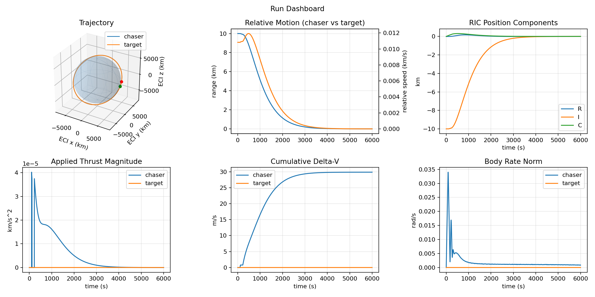
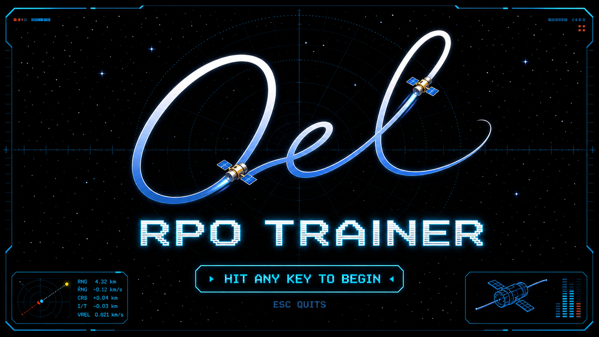

# Orbital Engagement Lab

[](https://github.com/adamcohen8/orbital-engagement-lab/actions/workflows/ci.yml)

Orbital Engagement Lab is an open-core Python/YAML simulator for spacecraft
rendezvous, proximity operations, and mission-analysis prototyping. Define a
scenario, run a deterministic simulation, and inspect review-ready Markdown,
JSON, CSV, SQLite, and plot artifacts.

Use OEL when you want to prototype closed-loop spacecraft behavior, not just
propagate a trajectory. A single scenario can combine orbital mechanics, attitude
dynamics, sensors, estimators, controllers, actuators, mission logic,
ground-station access, and output artifacts.

OEL is intended for research, education, prototyping, pre-flight engineering
analysis, and software-in-the-loop experimentation. It is not flight-qualified
software or an operational decision system.



## Fast Proof Path

Use Python 3.10 through 3.12. The commands below use Python 3.11; replace
`python3.11` with `python3.10` or `python3.12` if that is your installed
interpreter.

```bash
git clone https://github.com/adamcohen8/orbital-engagement-lab.git
cd orbital-engagement-lab
python3.11 -m venv .venv
.venv/bin/python -m pip install -U pip
.venv/bin/python -m pip install ".[dev]"
```

Check the environment:

```bash
.venv/bin/python run_simulation.py --doctor
```

Run the fast headless quickstart:

```bash
.venv/bin/python run_simulation.py --quickstart --validate-only
.venv/bin/python run_simulation.py --quickstart
```

Expected result: the run writes summary artifacts under
`outputs/quickstart_5min/`. Open `outputs/quickstart_5min/index.md` first.

Then run the flagship 10 km RIC_PD RPO review scenario:

```bash
.venv/bin/python run_simulation.py --config configs/ric_pd_10km_experiment.yaml --validate-only
.venv/bin/python run_simulation.py --config configs/ric_pd_10km_experiment.yaml
```

Expected result: OEL writes a dashboard, rendezvous summary, control-effort,
relative-range, trajectory, attitude, quaternion-error, and thrust-alignment
plots under `outputs/flagship_ric_pd_10km/`. Start with
`outputs/flagship_ric_pd_10km/index.md`, then compare against the checked-in
[Plot Gallery](docs/plot-gallery.md).

For a guided walkthrough, see [First Five Minutes](docs/first-five-minutes.md).

## What You Can Do

- Propagate spacecraft from classical orbital elements or TLE-initialized
  states.
- Run closed-loop chaser/target rendezvous and relative-motion scenarios.
- Exercise public orbit and attitude controllers, estimators, sensors, mission
  modules, and actuator models.
- Inspect passive ground-station access using line of sight, elevation, and
  range histories.
- Explore perturbation models, atmosphere, SRP, third bodies, spherical
  harmonics, re-entry diagnostics, and threshold termination criteria.
- Generate single-run dashboards, plots, summaries, review stores, and artifact
  indexes.
- Use a Python API or scenario YAML as the durable scenario interface.
- Launch the Pygame RPO trainer for hands-on relative-motion practice.
- Use checked-in OEL Agent instructions and task cards with AI coding
  assistants.

The primary public surfaces are the CLI, scenario YAML, Python API, review
query CLI/API, and the RPO trainer. The desktop GUI remains experimental. The
Output Review Workbench is an experimental dynamic plot creator for completed
runs; use it after a simulation writes `review/run.sqlite`, not as the
first-run path.

## Choose A Workflow

| Goal | Start here |
| --- | --- |
| First successful run | `.venv/bin/python run_simulation.py --quickstart` |
| Flagship RPO artifact review | `.venv/bin/python run_simulation.py --config configs/ric_pd_10km_experiment.yaml` |
| TLE-initialized propagation | `.venv/bin/python run_simulation.py --config examples/configs/public_tle_2hr_propagation.yaml` |
| Ground-station access from a TLE | `.venv/bin/python run_simulation.py --config examples/configs/public_ground_station_access_from_tle.yaml` |
| Closed-loop public rendezvous | `.venv/bin/python run_simulation.py --config examples/configs/public_closed_loop_rendezvous_lqr.yaml` |
| Mission-recovery smoke case | `.venv/bin/python run_simulation.py --config agents/examples/public_agent_mission_recovery_plus_c_burn.yaml` |
| Mission-reconstitution trade space | `.venv/bin/python run_simulation.py --config agents/examples/public_agent_mission_reconstitution_trade_space.yaml` |
| Attitude hold with disturbance torque | `.venv/bin/python run_simulation.py --config examples/configs/public_attitude_hold_disturbance.yaml` |
| Re-entry diagnostics | `.venv/bin/python run_simulation.py --config configs/reentry_smoke.yaml` |
| RPO trainer game | `.venv/bin/python -m pip install ".[game]"` then `.venv/bin/python run_game.py` |
| AI-agent golden paths | [Agent Golden Paths](docs/agent-golden-paths.md) |

TLE examples use TLE lines to initialize an ECI state, then OEL numerically
integrates the configured force model. Do not treat these examples as
SGP4/general-perturbations propagation.

## Use OEL With AI Coding Agents

The public repo includes OEL Agents: instructions, examples, task cards, and
tests for AI coding assistants such as Codex, Cursor, Claude Code, Gemini CLI,
and Grok Build.

The agent loop is:

```text
natural-language request -> scenario YAML -> validation -> deterministic run
-> review-store query or artifact inspection -> evidence-backed answer
```

For the shortest reliable path, point your agent at:

- [AGENTS.md](AGENTS.md)
- [agents/public/AGENTS.md](agents/public/AGENTS.md)
- [OEL Agents](docs/oel-agents.md)
- [Agent Golden Paths](docs/agent-golden-paths.md)
- [Agent Capability Routing](docs/agent-capability-routing.md)

Runs that enable `outputs.review.enabled: true` write
`review/run.sqlite`. Use the SELECT-only review CLI/API and cite the query or
saved query that supports a conclusion:

```bash
.venv/bin/python -m sim.review outputs/my_run --saved-query run_metadata
.venv/bin/python -m sim.review outputs/my_run --query "SELECT scenario_name, duration_s FROM run_metadata"
```

If an agent finds public-safe workflow friction, use
[Agent Feedback Loop](docs/agent-feedback-loop.md). Agents must show the draft
and ask before submitting feedback upstream.

## RPO Trainer



The bundled Pygame trainer turns RPO intuition into a playable progression:
tutorial, coast-relative motion, V-bar and R-bar approaches, close rendezvous,
passively safe inspection, eccentric-orbit lessons, defensive-target tracking,
evasive-target survival, sandbox, and arcade pursuit.

Install the game extra and launch the level selector:

```bash
.venv/bin/python -m pip install ".[game]"
.venv/bin/python run_game.py
```

Use Up/Down or W/S to choose a level, Left/Right to change assists, Enter or
Space to launch, and Escape to return to the selector. Training runs can also
write debriefs and recordings under `outputs/`; see
[Video Game Mode Roadmap](docs/game-mode-roadmap.md) for controls, debriefs,
recording, and level-design notes.

## Trust, Limits, And Safety

Orbital Engagement Lab is an independent personal-capacity software project. It
is not an official product, program, or endorsement of the Department of
Defense, Department of the Air Force, United States Space Force, or any other
U.S. Government organization.

The public repository should not contain nonpublic government information,
government-provided code, controlled operational scenarios, classified
information, or customer-controlled technical data. Users are responsible for
their own validation, security review, export-control review, mission
qualification, and compliance obligations before using the software in any
sensitive, commercial, government, or operational context.

Only run scenario YAML files from sources you trust. Scenario configs can point
at importable Python modules/classes for controllers, guidance, mission
strategies, and mission execution modules; loading an untrusted scenario can run
untrusted Python code. For untrusted configs, start with safe validation and the
security docs.

For vulnerability reporting, supply-chain evidence, data handling, export/CUI
boundaries, and incident response, start with:

- [Security Policy](SECURITY.md)
- [Supply Chain And Procurement Baseline](docs/security/supply-chain.md)
- [Data Handling And Boundary Statement](docs/security/data-handling.md)
- [Security Incident Process](docs/security/incident-response.md)

## Public Core And Pro Layer

The public core is useful on its own: deterministic single-run simulation,
public controllers and mission primitives, review artifacts, Python/YAML
interfaces, examples, docs, and the RPO trainer.

The Pro layer adds workflow acceleration for teams that need repeatable
analysis at scale: controller benchmarks, optimization and gain tuning,
Monte Carlo and sensitivity campaigns, curated validation packs, AI-assisted
reports, custom GNC workbench scaffolding, and program-specific integrations.

See [Public Core And Pro Boundary](docs/public-vs-pro.md) for what belongs in
the public core versus the Pro layer. Public examples do not require hosted AI
accounts or API keys.

## Documentation

- [Documentation Index](docs/index.md)
- [Quickstart](docs/quickstart.md)
- [First Five Minutes](docs/first-five-minutes.md)
- [Scenario YAML](docs/scenario-yaml.md)
- [Python API](docs/python-api.md)
- [Product Inventory](docs/product-inventory.md)
- [Flagship RIC_PD 10 km Scenario](docs/flagship-ric-pd-10km.md)
- [Review Store](docs/review-store.md)
- [Examples Matrix](docs/examples-matrix.md)
- [Known Limitations](docs/known-limitations.md)

## Install Profiles

```bash
.venv/bin/python -m pip install .
.venv/bin/python -m pip install ".[dev]"
.venv/bin/python -m pip install ".[game]"
.venv/bin/python -m pip install ".[ml]"
.venv/bin/python -m pip install ".[gui]"
.venv/bin/python -m pip install ".[full]"
```

The `gui` extra is for experimental desktop surfaces, including the Output
Review Workbench dynamic plot creator. Public onboarding should start with the
CLI/YAML/Python API path above. For scripted output inspection, prefer
`.venv/bin/python -m sim.review`.

## Bug Reports

For non-security bugs, open a GitHub Issue and use the Bug Report template.
Include the OEL version or commit, operating system, Python version, install
profile, exact command, minimal scenario/config or reproduction steps, expected
behavior, actual behavior, and relevant traceback or artifact path.

For simulation-model concerns, include the physical claim, scenario, reference
source or tolerance, and generated evidence. Do not post secrets, API keys,
customer data, CUI, export-controlled data, classified information, or private
generated report packets in public issues.

## Project Layout

- `run_simulation.py` CLI entrypoint for validation and simulation runs
- `run_game.py` Pygame RPO trainer launcher
- `sim/api.py` public programmatic API
- `sim/config/` config schema, fidelity profiles, and plugin validation
- `sim/dynamics/` orbit, attitude, environment, and propagation logic
- `sim/control/` orbit and attitude controllers
- `sim/actuators/` public actuator models
- `sim/sensors/`, `sim/estimation/`, `sim/knowledge/`, and `sim/mission/`
  closed-loop behavior components
- `sim/review/` review-store query API and saved queries
- `examples/` curated runnable configs
- `agents/` public agent instructions, examples, and task cards
- `docs/` user-facing documentation

## License

Apache License 2.0. See [LICENSE.txt](LICENSE.txt).
