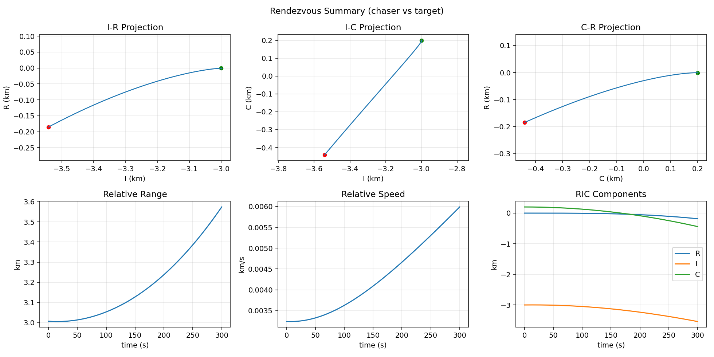
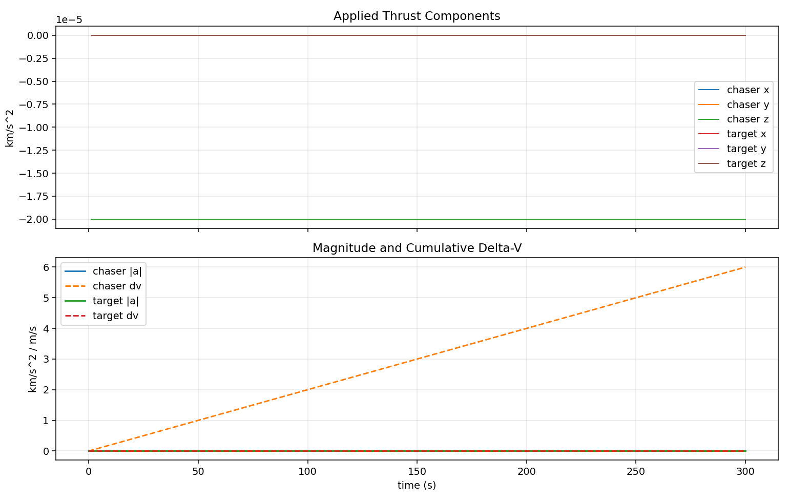
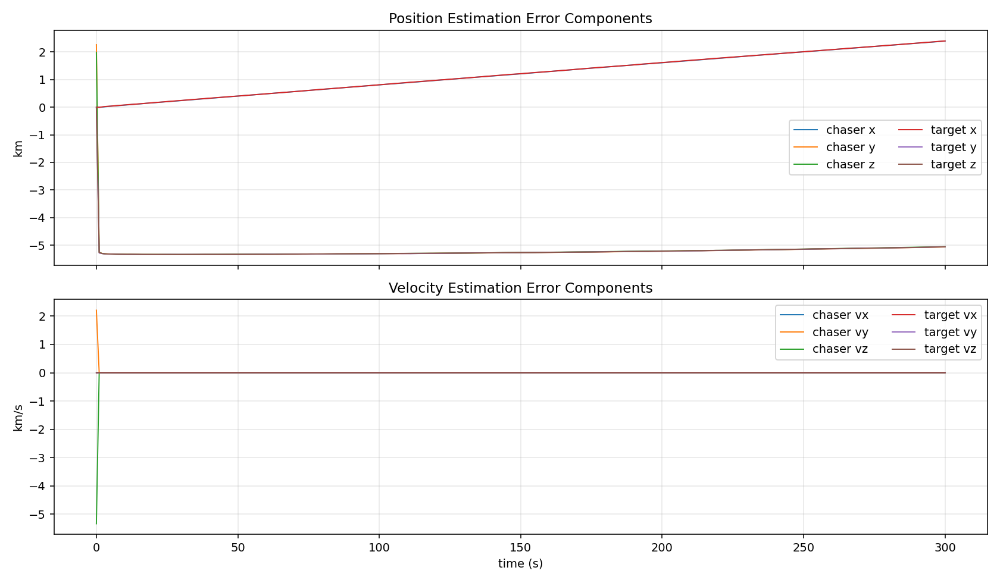
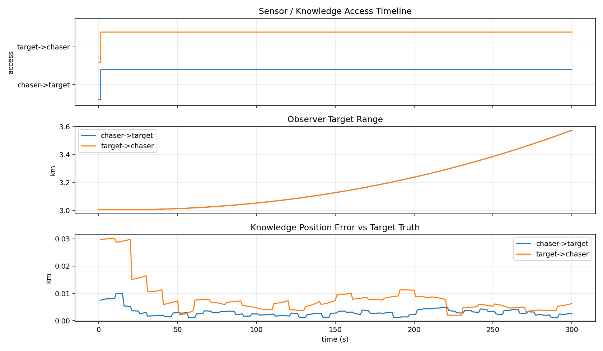
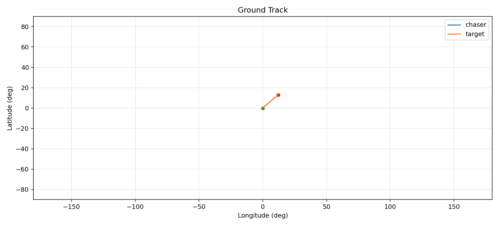

# Plot Gallery

These images are generated from the public-safe plotting rendezvous demo:

```bash
python run_simulation.py --config configs/plotting_rendezvous_demo.yaml
```

The demo writes run artifacts under `outputs/plotting_rendezvous_demo/`. The
gallery images below are checked-in snapshots so visitors can see the plotting
surface without running the simulator first.

## Run Dashboard


## Rendezvous Summary



## Control Effort



## Estimation Error Components



## Sensor Access



## Ground Track


