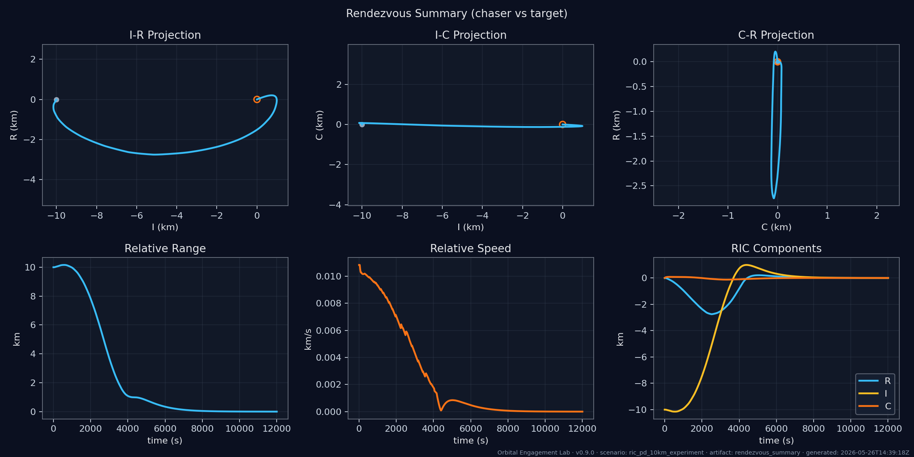
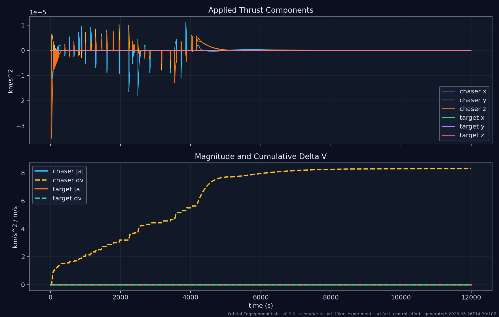
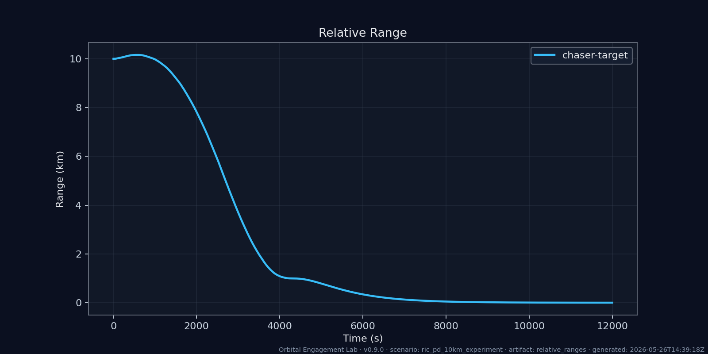
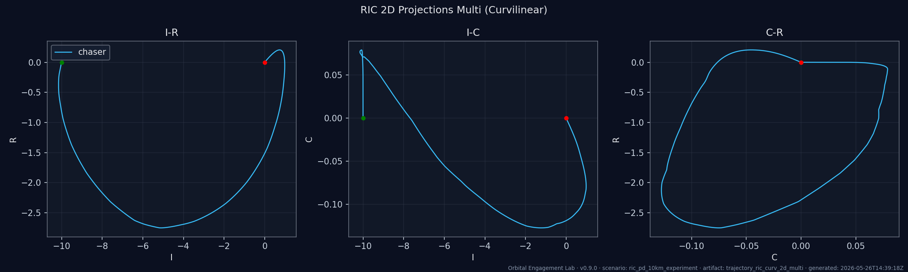
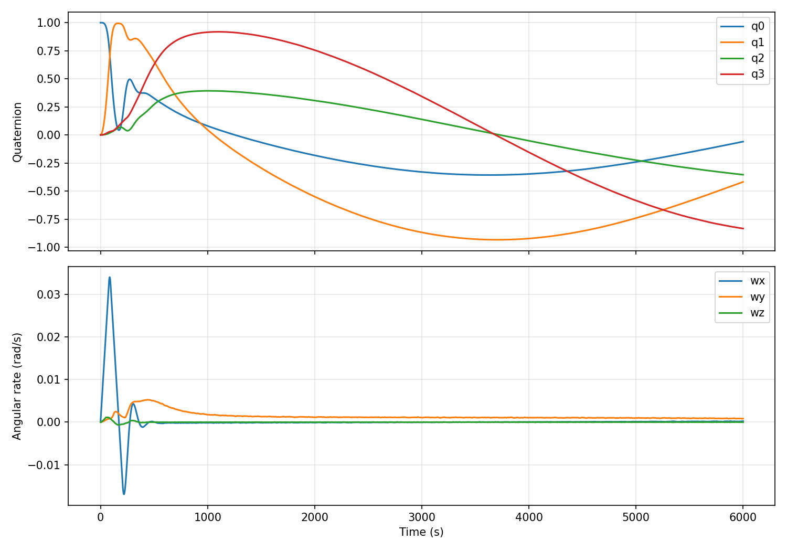
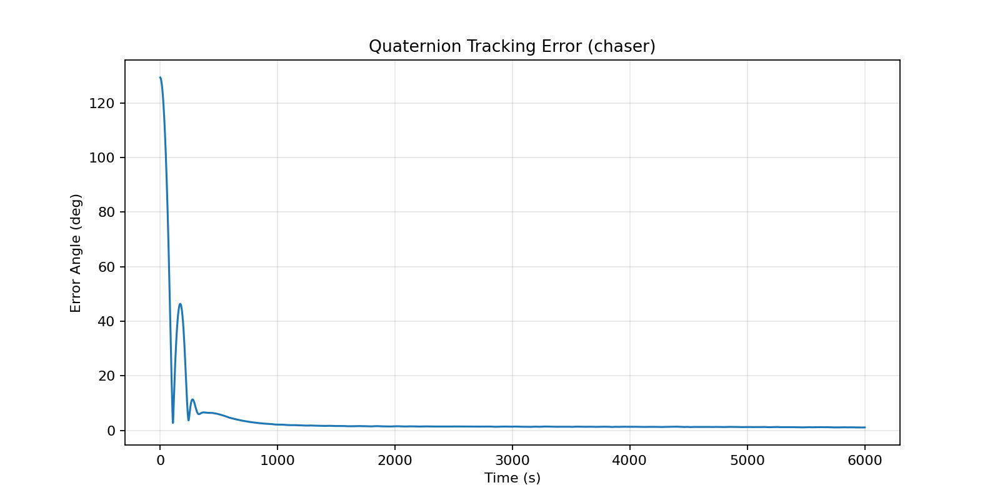
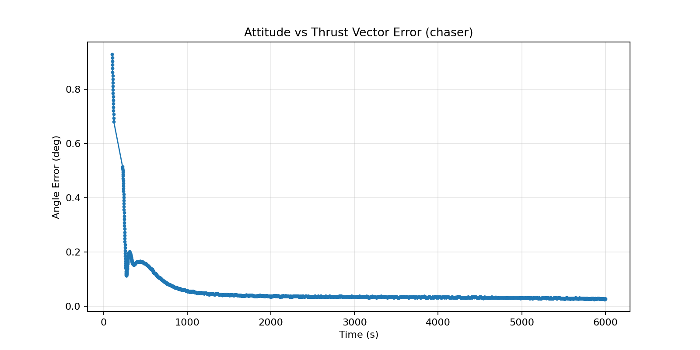

# Plot Gallery

These images are generated from the public-safe flagship 10 km HCW PD RPO
scenario:

```bash
python run_simulation.py --config configs/hcw_pd_10km_experiment.yaml
```

The scenario writes run artifacts under `outputs/flagship_hcw_pd_10km/`. The
gallery images below are checked-in snapshots from that run so visitors can see
the flagship plotting surface without running the simulator first. When you run
the scenario locally, start with `outputs/flagship_hcw_pd_10km/index.md` and use
this page as a quick visual reference.

## Run Dashboard


## Rendezvous Summary



## Control Effort



## Relative Range



## RIC Curvilinear Trajectory



## Integrated Attitude And Burn Gating

### Chaser Attitude



### Chaser Quaternion Error



### Chaser Thrust Alignment Error


