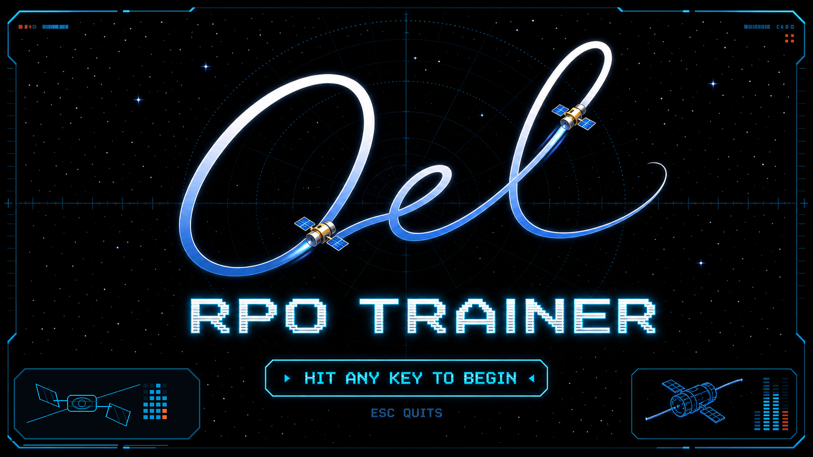
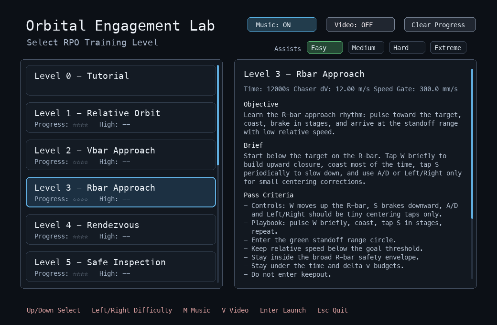
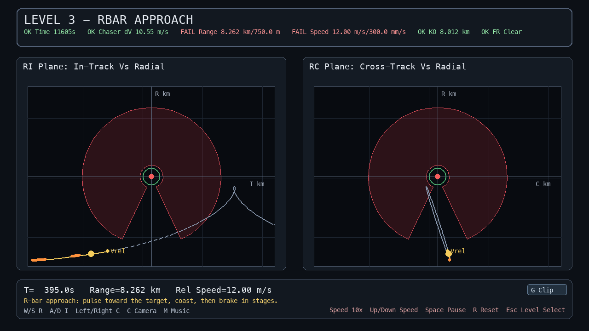
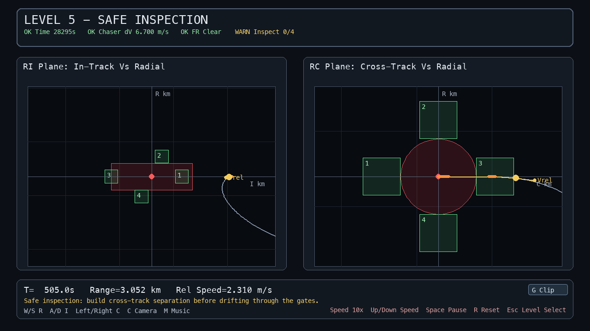

# Orbital Engagement Lab RPO Trainer

Interactive RIC-frame intuition training for rendezvous and proximity
operations education.

## What It Is

The Orbital Engagement Lab RPO Trainer is a public, open-source educational
tool that lets cadets manually command radial, in-track, and cross-track
maneuvers, observe the resulting relative orbital motion, and review structured
after-action debriefs tied to specific learning objectives.

It is not a replacement for classroom theory. It is a hands-on bridge between
relative-motion equations, instructor explanation, and the physical intuition
students need before RPO concepts feel natural.

## Why This Helps

Students can solve relative-motion equations before they develop intuition for
how spacecraft actually move near one another. Many first instincts come from
aircraft, driving, or flat-Earth motion: thrust toward the target, stop when
close, expect straight-line closure. Orbital relative motion does not reward
those instincts.

The RPO Trainer gives cadets a safe, repeatable feedback loop:

- predict what a maneuver should do;
- command radial, in-track, or cross-track inputs;
- observe the resulting RIC-frame motion;
- compare the outcome against pass/fail criteria and debrief metrics;
- try again with better intuition.

Because cadets directly control the spacecraft and receive immediate visual and
metric feedback, the trainer can make abstract relative-motion behavior more
memorable than static plots or worked examples alone.

## Curriculum Fit

The trainer reinforces concepts commonly taught in astronautics and space
operations courses:

- Hill/RIC frame interpretation;
- natural relative motion;
- rendezvous geometry;
- V-bar and R-bar approach logic;
- delta-v management;
- passive safety and keepout awareness.

## Visual Preview



The trainer opens with a level selector and guided launch flow designed for
local classroom use.

The level selector gives instructors and cadets a curated sequence of RPO
training levels with objectives, pass criteria, assist difficulty, video
recording, and progress controls.



Level 3 emphasizes R-bar approach geometry, staged braking, keepout awareness,
and the coupling between radial and in-track motion.



Level 5 asks students to build passively safer cross-track separation before
drifting through inspection gates around a forbidden in-track cylinder.



## Learning Objectives

Cadets can use the trainer to practice:

- RIC/Hill-frame relative-motion intuition.
- Natural motion, drift, and passive safety concepts.
- V-bar and R-bar approach discipline.
- Keepout-zone and goal-region awareness.
- Terminal rendezvous with range and range-rate constraints.
- Delta-v budgeting and after-action review.

## Suggested Classroom Use

A first classroom module can fit inside a short lab or lesson block:

| Time | Activity |
| --- | --- |
| 5 min | Instructor frames RIC axes, natural relative motion, and the training goal. |
| 10 min | Cadets complete the guided tutorial. |
| 15 min | Cadets attempt a focused level such as passive relative motion or V-bar approach. |
| 10 min | Instructor leads a debrief using generated metrics, trajectory plots, and common mistakes. |

The trainer can also support homework exploration, office-hour demos, or
instructor-led live demonstrations during an astrodynamics or space operations
lesson.

## Included Training Modes

- Guided tutorial for controls, RIC plots, pulse-and-coast behavior, and speed
  controls.
- Ten structured RPO levels covering passive motion, V-bar/R-bar approaches,
  terminal rendezvous, eccentric-orbit cases, and defensive-target examples.
- Sandbox mode for open-ended exploration.
- Arcade pursuit mode for replayable practice.
- Markdown/JSON debriefs and optional attempt recordings for structured
  training levels.

## Example First Lab

**Lab 1: Natural Relative Motion**

Objective:
Explain why passive relative motion in orbit does not behave like straight-line
translation in an inertial classroom sketch.

Student task:
Complete the guided tutorial, then attempt the passive relative-motion level.
Submit the generated debrief or selected screenshots showing the RIC trajectory,
closest approach, final range, final relative speed, keepout result, and
approximate delta-v.

Discussion prompts:

- Which parts of the motion matched your intuition?
- Which parts were surprising after you stopped thrusting?
- How did the RIC plots change your understanding of radial, in-track, and
  cross-track motion?
- What would you change on a second attempt?

## Evidence Produced

Structured training attempts can produce debrief folders under:

```text
outputs/game_debriefs/<scenario_id>/attempt_.../
```

Debriefs include:

- pass/fail result and miss reason;
- closest approach;
- final range;
- final relative speed;
- keepout time or violation status;
- approximate delta-v;
- trajectory and timeline plots;
- control-command and cumulative delta-v plots;
- concise coaching observations.

These artifacts make the trainer useful for reflective learning: students can
compare what they intended to do, what they commanded, and what the relative
motion actually did.

## Responsible Use

The RPO Trainer is an educational public beta. It is intended for intuition
building, classroom demonstration, and exploratory learning with public,
non-sensitive scenarios.

It is not flight-qualified software, an operational training system, a
certification environment, mission-assurance evidence, or a substitute for
formal astrodynamics instruction and validation.

## Feedback Request

I would value instructor feedback on whether this could support RPO
intuition-building in an astronautics or space operations classroom. Useful
feedback would include:

- whether the first-lab flow matches real teaching needs;
- which levels best support existing course objectives;
- what terminology, diagrams, or debrief fields would make it more useful to
  cadets;
- what should be simplified before classroom use;
- what evidence an instructor would want students to submit.

## Try It Locally

Clone the public repository, install the game dependencies, then launch the
level selector:

```bash
git clone https://github.com/adamcohen8/orbital-engagement-lab.git
cd orbital-engagement-lab
python -m venv .venv
source .venv/bin/activate
.venv/bin/python -m pip install ".[game]"
.venv/bin/python run_game.py
```

For project context, see `docs/game-mode-roadmap.md`.

## Web Preview

A lightweight browser preview is available for quick demos without installing
the Python package:

```text
https://adamcohen8.github.io/orbital-engagement-lab/
```

The web preview includes the tutorial, sandbox-style RIC controls, and the beta
Pursuit Arcade with browser-native replay validation and hosted leaderboard
hooks. The full local trainer includes the complete downloadable level set,
scenario YAML support, recordings, and structured debrief reports.

To run the same preview locally:

```bash
.venv/bin/python -m http.server 8765 --directory web/rpo-trainer-preview
```

Then open `http://localhost:8765`.
